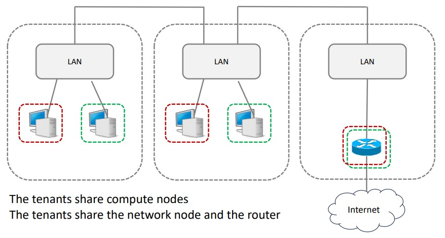
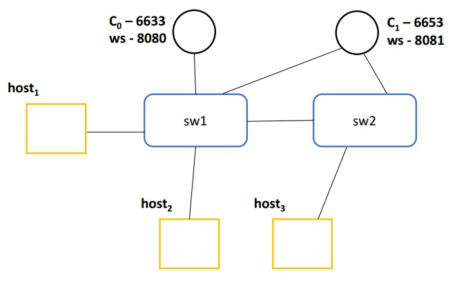
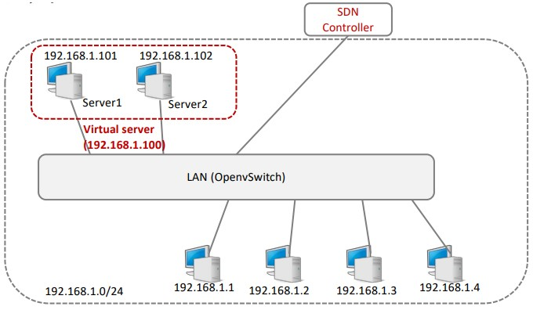

# Programmable Networks Exercises

## Exercise 1: Network Namespace and VLAN Configuration

Folder `Homework1` contains scripts to configure network namespaces, VLANs, and switches using Open vSwitch (OVS). The setup simulates two rooms, each hosting devices for two tenants. Each tenant has isolated network environments with VLANs configured for traffic separation, and the setup includes a trunk link between rooms for inter-VLAN routing.

### Topology Overview

The setup follows this network topology:



- **Tenant 1 (Red):** IP network `10.0.1.0/24`, Gateway `10.0.1.254`
- **Tenant 2 (Green):** IP network `10.0.2.0/24`, Gateway `10.0.2.254`
- Each tenant has a device in two physical rooms connected to switches. 
- The switches are connected with a trunk link to allow communication between VLANs across rooms.

### Files in the Repository

#### 1. `homework1.sh`

This script configures the network environment as described below:

- **Network Namespaces:** Created for each tenant's device in Room 1 and Room 2.
- **Open vSwitch Bridges:** Created for each room to handle VLAN traffic.
- **VLAN Configuration:** VLAN 10 for Tenant 1, VLAN 20 for Tenant 2.
- **IP Assignment:** Assigns IP addresses for devices of each tenant.
- **Switch Connections:** Configures a trunk link between switches in Room 1 and Room 2 to carry traffic for VLANs 10 and 20.
- **Routing and IP Forwarding:** Enables IP forwarding to route traffic between VLANs and ensure connectivity between tenant devices across rooms.

#### 2. `clear.sh`

This script cleans up the network environment by deleting all namespaces, bridges, and links created during the setup process.

### Usage Instructions

#### 1. Setup the Network

Run the `homework1.sh` script to set up the network:

```bash
sudo ./homework1.sh
```

This will create the namespaces, switches, VLANs, and configure IP addresses for each tenant device.

#### 2. Clean Up the Network
After testing or using the setup, you can clean up the environment using the clear.sh script:

```bash
sudo ./clear.sh
```

This will delete all network namespaces, bridges, and links, restoring the system to its initial state.

## Exercise 2: Network Topology with Mininet and Ryu Controllers

Exercise in folder `Homework2` simulates a simple network topology using Mininet with two external controllers. The topology consists of two switches (`sw1` and `sw2`), three hosts (`h1`, `h2`, `h3`), and two Ryu controllers (`C0` and `C1`). The controllers communicate with the switches using the OpenFlow protocol, where one controller is assigned as the master for `sw1` and the other as the master for `sw2`.

The purpose of this setup is to explore the behavior of the network when switching the roles of the controllers between master and slave, as well as to see how the network behaves when one of the controllers is stopped.

### Topology Diagram



### Prerequisites

- **Mininet**: A network emulator to create and manage the virtual network.
- **Ryu**: A component-based software-defined networking (SDN) framework.

Ensure both tools are properly installed.

### Files

- `2switch_3host_2ext_cntlr.py`: Defines the network topology using Mininet.
- `solution.md`: Contains the instructions for setting up and testing the network.

## Exercise 3: SDN-Based Load Balancer with Ryu Controller

The exercise in folder `Homework3` contains an SDN load balancer implementation using the Ryu controller framework. The load balancer distributes incoming traffic between two physical servers using a virtual server IP, through round-robin load balancing. The setup is depicted in the provided network topology.

### Features

- **Virtual IP Load Balancing:** A virtual server (`192.168.1.100`) distributes TCP traffic between two physical servers (`192.168.1.101` and `192.168.1.102`).
- **Round-Robin Scheduling:** Incoming traffic is balanced alternately between the two servers.
- **SDN Controller:** The Ryu-based controller dynamically manages flow rules for OpenFlow switches.
- **ARP Handling:** Responds to ARP requests for the virtual IP and routes traffic accordingly.

### Network Topology

The topology for this implementation is as follows:



- **Virtual IP:** `192.168.1.100`
- **Server 1:** `192.168.1.101` with MAC `00:00:00:00:00:01`
- **Server 2:** `192.168.1.102` with MAC `00:00:00:00:00:02`
- **LAN Switch:** Simulated by Open vSwitch (OpenFlow-enabled).

### Usage Instructions
First, start the Ryu application which acts as the SDN controller.

```bash
ryu-manager load_balancer.py
```
After the setup, send traffic to the virtual IP (`192.168.1.100`) on TCP port `8080`. The controller will alternate traffic between `Server 1` and `Server 2` using round-robin scheduling.

Use tools like curl or iperf to test the load balancing functionality:

```bash
curl http://192.168.1.100:8080
```

## Exercise 4: P4 exercises

The `Homework4` folder contains P4 programs that define basic packet processing operations for networking, including IPv4 header parsing, packet classification, and congestion handling.